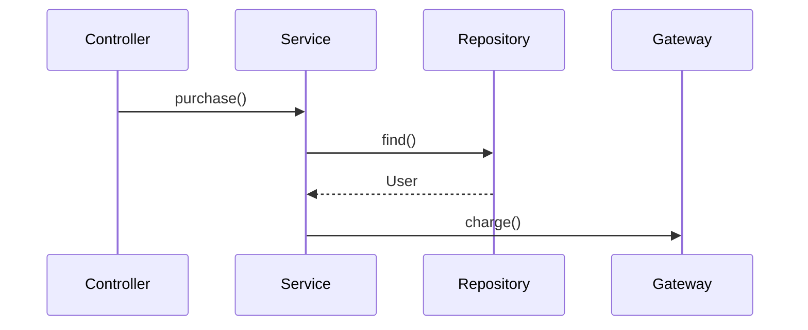

# Flow Lens Development Plan

## 1. Overview

Flow Lens is an IntelliJ Platform plugin that statically analyzes the execution flow starting from a developer-selected method and visualizes how processing proceeds through the codebase.

The core idea is simple:

> Select a method. See where the code flows.

Unlike a repository-wide analyzer, Flow Lens focuses on a deliberately narrow starting point: one method selected by the user. This keeps analysis practical on large codebases while producing a visualization that is directly useful for code reading, debugging, code review, onboarding, and impact investigation.

Flow Lens is not intended to perfectly reconstruct runtime behavior. Instead, it should provide a fast, explainable, IDE-native static approximation of the flow, while clearly exposing ambiguity where static analysis cannot determine a single target.

---

## 2. Product Goals

### Primary goals

- Analyze an arbitrary method selected in the IntelliJ editor.
- Resolve method calls reachable from that method.
- Preserve source-level execution order rather than showing only a flat call hierarchy.
- Visualize calls, branches, returns, exceptions, loops, and unresolved/ambiguous targets.
- Allow users to jump from visualization nodes back to source code.
- Keep analysis bounded so it remains responsive on real-world repositories.
- Allow frequently used methods and analyzed flows to be saved for quick access.
- Work fully locally without requiring an external server or AI API.

### Secondary goals

- Provide multiple views over the same analysis model, such as Tree, Flow, and Sequence views.
- Export analysis results in reusable formats such as Markdown and Mermaid.
- Make the analysis process visible enough that users can understand what the plugin is doing.
- Reuse IntelliJ Platform code intelligence instead of implementing a standalone parser or indexer where possible.

---

## 3. Non-Goals

The initial versions should explicitly avoid the following:

- Whole-repository exhaustive control-flow analysis.
- Guaranteed runtime-accurate execution traces.
- Full interprocedural symbolic execution.
- Runtime instrumentation or profiler-style tracing.
- Complete handling of reflection, dynamic proxies, event buses, framework magic, or runtime configuration.
- Automatically choosing a single implementation when static analysis finds multiple valid targets.
- Replacing IntelliJ's existing Call Hierarchy or Bookmarks features.

Flow Lens should prefer an honest `ambiguous`, `external`, or `unresolved` result over pretending certainty.

---

## 4. Core User Experience

### 4.1 Start analysis

The user places the caret inside a method and invokes:

- Editor context menu: `Flow Lens > Analyze Execution Flow`
- Optional shortcut.
- Tool Window action: `Analyze Current Method`

Example source:

```java
public void purchase(Order order) {
    validate(order);

    User user = userRepository.find(order.userId());

    if (user.hasBalance()) {
        paymentService.charge(user, order);
    }

    orderRepository.save(order);
    notificationService.send(user);
}
```

The initial visualization should preserve the logical source order:

```text
purchase()
   │
   ├─ validate()
   │
   ├─ userRepository.find()
   │
   ├─ [if user.hasBalance()]
   │       │
   │       └─ paymentService.charge()
   │               │
   │               ├─ paymentGateway.request()
   │               └─ transactionRepository.save()
   │
   ├─ orderRepository.save()
   │
   └─ notificationService.send()
```

This is intentionally different from a conventional Call Hierarchy. The plugin should model the method body as an execution structure, not merely a set of outgoing edges.

---

## 5. Analysis Model

### 5.1 Entry point

Every analysis starts from exactly one method or function.

The selected entry point should be represented by a stable source identifier containing at least:

- Project-relative file path.
- Symbol name.
- Containing class/object where applicable.
- Method/function signature where available.
- Source offset or PSI smart pointer for navigation.

### 5.2 Analysis strategy

High-level algorithm:

```text
Selected method
    ↓
Obtain PSI/UAST representation
    ↓
Walk statements in source order
    ↓
Detect executable constructs
    ↓
Resolve method/function calls
    ↓
Create flow nodes and edges
    ↓
Recursively analyze project-local targets
    ↓
Stop when configured limits are reached
```

The implementation should use IntelliJ Platform PSI and, where appropriate, UAST rather than parsing source text manually.

### 5.3 Node types

The analysis model should be designed for more than method calls from the beginning.

Suggested node types:

- `ENTRY`
- `METHOD_CALL`
- `CONDITION`
- `SWITCH`
- `LOOP`
- `RETURN`
- `THROW`
- `TRY`
- `CATCH`
- `FINALLY`
- `ASYNC_BOUNDARY`
- `EXTERNAL_CALL`
- `AMBIGUOUS_CALL`
- `UNRESOLVED_CALL`
- `CYCLE`
- `LIMIT_REACHED`

Not all node types need to be supported in v0.1, but the internal model should not assume that every node is a method.

### 5.4 Edge types

Suggested edge semantics:

- Normal execution.
- Call.
- Return.
- True branch.
- False branch.
- Switch case.
- Exception path.
- Loop body.
- Ambiguous candidate.

This allows the rendering layer to evolve without changing the fundamental analysis result.

---

## 6. Method Resolution

### 6.1 Project-local methods

If a call can be resolved to a method/function inside the current project, Flow Lens may recursively analyze it according to the configured depth and limits.

### 6.2 External libraries

External library calls should stop by default and be represented as terminal nodes.

Example:

```text
paymentGateway.request()
    ↓
[External] okhttp3.Call.execute()
```

Users may later be given an explicit action such as `Expand External Call`, but external traversal should not be enabled by default.

### 6.3 Interfaces and multiple targets

When a call resolves to an interface, abstract method, virtual dispatch point, or otherwise has multiple plausible implementations, Flow Lens must not silently choose one.

Example:

```text
paymentService.pay()
    │
    ├─ CreditCardPaymentService.pay()
    ├─ PayPayPaymentService.pay()
    └─ BankPaymentService.pay()
```

The visualization should make the ambiguity visible and allow the user to expand one or more candidates manually.

Possible future enhancement:

- Rank likely targets using IDE/framework knowledge.
- Mark known Spring bean implementations.
- Allow users to select a preferred target for the current Saved Flow.

These should remain hints, not claims of runtime certainty.

### 6.4 Unresolved calls

If IntelliJ cannot resolve the target, create an explicit unresolved node.

```text
someDynamicCall()
    ↓
[Unresolved]
```

The user should still be able to navigate to the call site.

---

## 7. Control-Flow Visualization

### 7.1 Conditions

Conditions are a major differentiator from ordinary call graphs.

Example:

```java
if (user == null) {
    throw new UserNotFoundException();
}

if (!user.isActive()) {
    disable(user);
    return;
}

process(user);
```

Desired conceptual visualization:

```text
◇ user == null ?
   ├─ YES → throw UserNotFoundException
   └─ NO
       ↓
◇ !user.isActive() ?
   ├─ YES → disable()
   │          ↓
   │        return
   └─ NO → process()
```

### 7.2 Switch / when

Switch-like constructs should create one branch per case where feasible.

### 7.3 Loops

Loops should be represented as structured nodes rather than expanded indefinitely.

Example:

```text
[for each item]
    ↓
process(item)
    ↺
```

Recursive expansion inside the loop is allowed, but the loop itself must provide a natural cycle boundary.

### 7.4 Exceptions

`throw`, `try`, `catch`, and `finally` should become explicit once control-flow support is introduced.

Exact exception propagation between methods is not required for the first implementation.

---

## 8. Analysis Limits

Flow Lens must be defensive by default.

Suggested defaults:

```text
Max depth                3
Max nodes              100
Project sources only     ON
Include tests           OFF
Include libraries       OFF
```

Configurable limits should include:

- Maximum recursive depth.
- Maximum total nodes.
- Maximum candidate implementations per ambiguous call.
- Whether tests are included.
- Whether external libraries may be expanded.
- Package/module include and exclude rules.

When a limit is reached, the graph must contain a visible terminal marker instead of silently truncating the result.

Example:

```text
OrderService.execute()
    ↓
[Depth limit reached]
```

---

## 9. Cycle Detection

Recursive calls and cyclic dependency paths must not cause infinite analysis.

Example:

```text
A.foo()
  ↓
B.bar()
  ↓
A.foo()
  ↓
[Cycle → A.foo()]
```

Cycle detection should operate on symbol identity within the current traversal path rather than globally suppressing all repeated methods. The same method may legitimately appear in multiple different branches.

---

## 10. Tool Window

Flow Lens should have a dedicated Tool Window.

Initial structure:

```text
FLOW LENS

Analyze
────────────────────────
▶ Analyze Current Method

Current Flow
────────────────────────
PaymentService.execute()
Depth: 3 | Nodes: 26

Pinned
────────────────────────
★ Payment Entry
★ Transaction Lock
★ User Lookup

Saved Flows
────────────────────────
★ Purchase Flow
★ Login Flow
★ Refund Flow

Recent
────────────────────────
○ UserService.update()
○ OrderService.create()
```

The graph/flow visualization should occupy the main part of the Tool Window or optionally open in an editor tab if the IntelliJ Platform integration makes that experience better.

---

## 11. Navigation

Every source-backed node should support:

- Single click: select node and show details.
- Double click / Enter: navigate to source.
- Context action: `Open Source`.
- Context action: `Analyze from Here`.
- Context action: `Pin Method`.

Navigation should use IntelliJ source navigation APIs and smart PSI pointers where appropriate.

---

## 12. Flow Pins

IntelliJ already has general-purpose bookmarks, so Flow Lens should not duplicate them directly.

Instead, Flow Lens should introduce method-oriented `Flow Pins`.

Example:

```text
★ Payment Entry
  PaymentController.purchase()

★ Payment Core
  PaymentService.execute()

★ Transaction Lock
  TransactionLock.acquire()
```

A Flow Pin represents a meaningful method/function entry point and should survive IDE restarts and ordinary source edits where IntelliJ can still resolve the symbol.

Possible metadata:

- User-defined display name.
- Symbol reference.
- File path.
- Method signature.
- Optional note.
- Date pinned.

Flow Pins are intended for quick navigation and for quickly starting a new analysis from a known entry point.

---

## 13. Saved Flows

A Saved Flow stores an analysis configuration, not only a code location.

Example:

```text
★ Purchase Flow
  Entry: PaymentController.purchase()
  Depth: 5
  Nodes: 23

★ Login Flow
  Entry: AuthController.login()
  Depth: 4
  Nodes: 17
```

Saved Flow data should include:

- Entry point.
- Analysis settings.
- User-defined name.
- Optional selected implementation choices for ambiguous calls.
- Optional collapsed/expanded UI state.

The cached analysis graph itself may initially be regenerated on demand rather than persisted permanently.

Future enhancement:

- Detect when the source has changed since the last analysis.
- Display `Flow changed` or `Needs re-analysis`.
- Compare two flow snapshots.

---

## 14. Visualization Modes

### v0.x Tree / Flow View

Start with the simplest maintainable visualization capable of expressing nesting and branches.

Required capabilities:

- Expand/collapse nodes.
- Show node type icons.
- Show project vs external calls.
- Show ambiguity and unresolved status.
- Navigate to source.

### Future Graph View

A node-edge graph can make larger flows easier to explore.

Desired interactions:

- Pan and zoom.
- Expand on demand.
- Collapse subtrees.
- Highlight the selected path.
- Fit graph to viewport.

### Future Sequence View

Sequence View should derive from the same analysis model.

Conceptual output:

```text
Controller      Service       Repository      Gateway
    │              │               │              │
    │ purchase()   │               │              │
    ├─────────────►│               │              │
    │              │ findUser()    │              │
    │              ├──────────────►│              │
    │              │◄──────────────┤              │
    │              │                              │
    │              │ charge()                     │
    │              ├─────────────────────────────►│
    │              │◄─────────────────────────────┤
```

Sequence View should not be required for MVP.

---

## 15. Analysis Progress UX

The plugin should visibly communicate analysis progress without relying on decorative animation alone.

Example status:

```text
Analyzing PaymentService.execute()

14 methods resolved
 8 project methods
 3 branches
 2 external calls
 1 ambiguous call
```

As analysis proceeds, the UI may progressively add nodes or update counters.

Requirements:

- Analysis must be cancellable.
- Long-running work must not block the EDT.
- The current stage should be understandable.
- Partial results should remain useful if analysis is cancelled or reaches limits.

---

## 16. Export

### Markdown

Provide a text representation that is easy to paste into issues, documentation, or AI tools.

Example:

```markdown
# Purchase Flow

1. PaymentController.purchase()
2. PaymentService.execute()
3. PaymentRepository.find()
4. PaymentGateway.charge()
```

### Mermaid

Mermaid export is a strong fit because Flow Lens already produces structured graph data.

Example:



Possible export actions:

- Copy as Markdown.
- Copy as Mermaid flowchart.
- Copy as Mermaid sequenceDiagram.

Export should operate on the analysis model rather than scraping the rendered UI.

---

## 17. Proposed Architecture

Keep analysis, model, persistence, and rendering separated.

```text
flow-lens
├─ analysis
│  ├─ entrypoint
│  ├─ traversal
│  ├─ resolution
│  ├─ controlflow
│  └─ limits
│
├─ model
│  ├─ FlowGraph
│  ├─ FlowNode
│  ├─ FlowEdge
│  └─ FlowAnalysisResult
│
├─ ui
│  ├─ toolwindow
│  ├─ tree
│  ├─ graph
│  └─ details
│
├─ navigation
│
├─ persistence
│  ├─ FlowPins
│  └─ SavedFlows
│
├─ export
│  ├─ markdown
│  └─ mermaid
│
└─ settings
```

Exact package layout can change during implementation; the architectural boundary is more important than the names.

### Key principle

The UI must consume a language-neutral `FlowAnalysisResult`.

Language-specific PSI/UAST handling should stay behind the analysis layer so that adding support for another language does not require rewriting visualization or persistence code.

---

## 18. Language Support Strategy

Language support should be incremental.

### Initial target

Start with the language that provides the most reliable path to validating the core product, most likely Java on IntelliJ IDEA.

### Next step

Evaluate Kotlin/JVM through UAST and shared IntelliJ Platform abstractions.

### Long-term

Other IntelliJ-supported languages may be added through language-specific analyzers/adapters where sufficient PSI support exists.

The plugin should not advertise a language as supported until method resolution, navigation, and core flow extraction work reliably for that language.

Suggested abstraction:

```text
FlowLanguageAnalyzer
  ├─ JavaFlowAnalyzer
  ├─ KotlinFlowAnalyzer
  └─ ...
```

Avoid forcing every language into UAST if PSI-native analysis is more accurate for a particular language.

---

## 19. Performance and Threading

Performance is part of the product design, not a later optimization.

Requirements:

- Never perform significant analysis synchronously on the EDT.
- Respect IntelliJ read actions and cancellation semantics.
- Reuse IDE indexes and reference resolution APIs.
- Stop early at configured limits.
- Avoid whole-project scans during ordinary method analysis.
- Consider memoizing repeated symbol resolution during one analysis session.
- Avoid recursively expanding library source by default.

Possible future optimization:

- Cache per-method direct-flow extraction keyed by source modification state.
- Invalidate cached fragments only when relevant PSI changes.

---

## 20. MVP Roadmap

## v0.1 — Method Call Flow

Goal: prove that a user can select a method and immediately understand what it calls.

Scope:

- IntelliJ Platform plugin skeleton.
- `Analyze Execution Flow` editor action.
- Resolve the current method.
- Walk method body in source order.
- Extract direct method calls.
- Recursively analyze project-local methods.
- Configurable max depth.
- Max node limit.
- Cycle detection.
- External/unresolved terminal nodes.
- Tool Window.
- Tree/flow visualization.
- Node-to-source navigation.
- Cancel running analysis.

Acceptance criteria:

1. User can place the caret in a Java method and start Flow Lens.
2. Direct calls appear in source order.
3. Project-local calls can be expanded recursively up to the configured depth.
4. Recursive calls do not hang the IDE.
5. External and unresolved calls are visibly differentiated.
6. Clicking a source-backed node navigates to the target declaration.
7. Analysis remains cancellable and does not block the UI thread.

---

## v0.2 — Control Flow

Goal: make Flow Lens meaningfully different from Call Hierarchy.

Scope:

- `if / else`.
- `switch`.
- loops.
- `return`.
- `throw`.
- basic `try / catch / finally` representation.
- explicit branch edges.
- branch-aware rendering.

Acceptance criteria:

1. The visualization preserves meaningful branch structure.
2. Calls inside a branch are visually nested under that branch.
3. Return and throw terminate the corresponding path in the model.
4. Loops are represented without infinite expansion.

---

## v0.3 — Developer Workflow

Goal: make Flow Lens useful every day, not only as a one-shot visualizer.

Scope:

- Flow Pins.
- Saved Flows.
- Recent analyses.
- Analyze from selected node.
- Persist pins and saved flow definitions across IDE restarts.
- Better analysis progress UI.

Acceptance criteria:

1. User can pin a method and jump back to it later.
2. User can save a named analysis configuration.
3. Saved items survive project restart.
4. A saved entry can be re-analyzed without finding the method manually.

---

## v0.4 — Sharing and Ambiguity

Goal: make analysis results useful outside the plugin and more honest on polymorphic code.

Scope:

- Multiple implementation candidates.
- Candidate selection/expansion.
- Markdown export.
- Mermaid flowchart export.
- Mermaid sequence export where model data is sufficient.
- Copy result for external analysis tools / AI.

Acceptance criteria:

1. Ambiguous calls never silently appear as a single definite implementation.
2. Users can inspect candidate implementations.
3. Exported Mermaid renders into a useful diagram for typical flows.

---

## v0.5+ — Advanced Exploration

Candidate features:

- Graph View.
- Sequence View.
- Flow snapshot comparison.
- `Flow changed` detection.
- Framework-aware resolution helpers.
- Module/package boundaries.
- Filters and search inside large flows.
- Highlight only one selected execution path.
- Callers / reverse-flow analysis.
- Test discovery for a selected flow.
- Git diff overlay to show which nodes changed in the current branch.

These are intentionally outside MVP.

---

## 21. Open Design Questions

The following should be decided through prototypes rather than prematurely fixed:

1. Should the primary visualization live in a Tool Window, editor tab, or support both?
2. Is the IntelliJ tree UI sufficient for v0.1, or is a custom graph component worth introducing immediately?
3. How much branch structure can be extracted reliably with PSI alone versus using control-flow APIs available per language?
4. How should method identity be persisted so Flow Pins survive refactors as well as possible?
5. Should ambiguous targets be expanded automatically up to a small threshold or always require user action?
6. Should recursion depth count only method boundaries or all structural flow nodes?
7. How should lambdas and callbacks appear in the flow model?
8. How should asynchronous boundaries such as futures/coroutines be represented without implying synchronous execution?
9. What is the right language support boundary for the first public release?

---

## 22. Product Principles

### Explain uncertainty

Static analysis has limits. Show those limits explicitly.

### Analyze locally, not globally

The user chooses the entry point. Flow Lens follows only what is relevant to that analysis.

### Preserve code meaning

Source order, branches, returns, loops, and ambiguity matter more than producing a visually impressive graph.

### Progressive disclosure

Start small and let users expand deeper paths on demand.

### IDE-native first

Use IntelliJ navigation, PSI, indexes, actions, persistence, progress, and UI conventions whenever they fit.

### Useful without AI

The core feature must remain fully useful offline and without paid APIs. AI tools can consume exported context, but Flow Lens itself should not depend on them.

---

## 23. Initial Product Statement

**Flow Lens is an IntelliJ plugin that turns a selected method into an explorable static execution-flow map.**

It helps developers answer:

- What does this method call?
- In what order does processing proceed?
- Where does the flow branch?
- Which calls leave the project?
- Which targets are ambiguous?
- Where can I jump next to understand this feature?

The initial product should succeed at one thing before expanding further:

> Right-click a method and get a useful, navigable picture of how that code flows.
